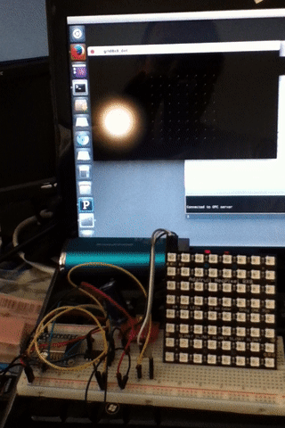

# espopc
ESP8266 Open Pixel Control protocol for WS281x LEDs

ESPOPC is similar to a Fadecandy controller with Fadecandy server with a WiFi
interface. Adding a battery makes the LED array + ESP8266 combination portable.

## System overview

```
 PC running      -> WiFi -> ESP8266 -> 3.3V -> 5V -> NeoPixel
 grid8x8_dot.pde                                     8x8 array
```

- Drives one WS2812 LED strip up to 1024 LEDs but only tested up to 64 LEDs arranged in an 8x8 grid.
- Implements the Open Pixel Control protocol on TCP port 7890. This is the same protocol used by fadecandy server (fcserver).

This is not a Fadecandy controller hardware clone.

- No dithering.
- No keyframe interpolation.
- High frame rates can crash the ESP8266
- Fixed gamma correction of 2.2
- SysEx ignored.

## Compiling

*WARNING*

Build this program using ESP8266 board package 1.6.4-673-g8cd3697. Building
with a newer version will result in WDT Reset crashes!

## Example programs to drive the LEDs

Many open pixel control and Fade Candy examples work with ESPOPC. Be sure to
modify the examples with the ESP IP address.

The following examples from https://github.com/zestyping/openpixelcontrol work
with ESPOSC.

    python\_clients/
        lava_lamp.py,miami.py,nyan_cat.py,sailor_moon.py,spatial_stripes.py

```
$ ./lava\_lamp.py -l grid8x8.json -s <ESP IP addr>:7890 -f 20
```

The Fadecandy grid8x8 Processing examples at https://github.com/scanlime/fadecandy work with ESPOSC. These examples show how
to create interactive LED displays. Edit the PDE file to add the ESP IP address.

    examples/processing/
        grid8x8_dot, grid8x8_noise_sample, grid8x8_orbits, grid8x8_wavefronts



## References

The NeoPixelBus library is used to drive the WS281x LEDs.
See https://github.com/Makuna/NeoPixelBus for more details.

See https://github.com/zestyping/openpixelcontrol for the OPC protocol
specification.

This Adafruit LED art tutorial covers wiring and powering the LEDs, etc. In
addition, it covers installing and running Fadecandy example programs.

https://learn.adafruit.com/led-art-with-fadecandy/
